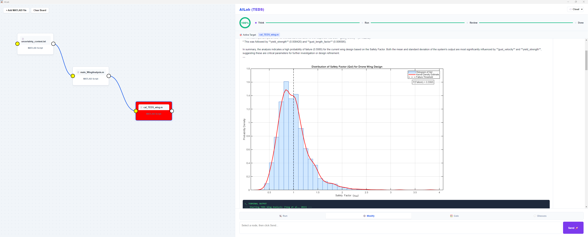
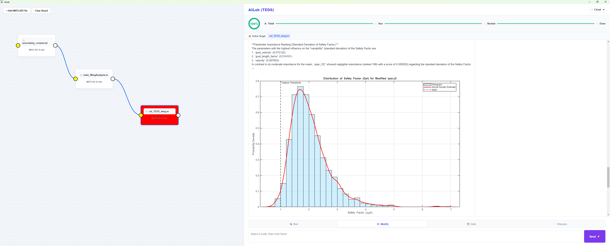

# D2N_DroneDesign
Digital Design Network+ Case Study 1 - Sensitivity Guided Design with LLM Acceleration

## Initial Design: 
AI agent runs the design at nominal design point and found that the failure probability is too high: 

## Updated Design with AI: 
AI uses the information given by  [TEDS](/../../../../longitude-jyang/TEDS-ToolboxEngineeringDesignSensitivity)  and update the design, where only one parameter is updated, and the failure probabiliy is much improved: 

